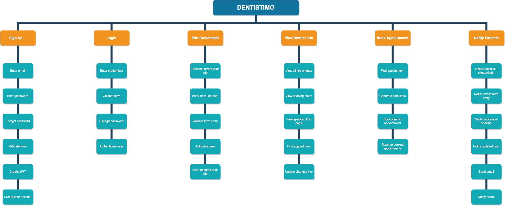
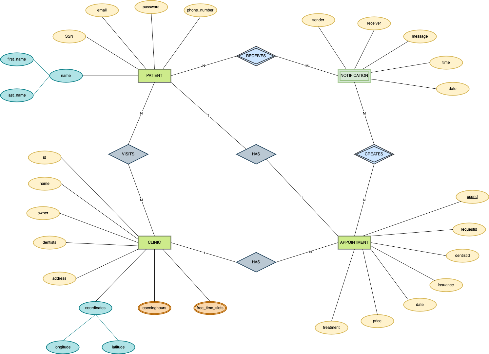
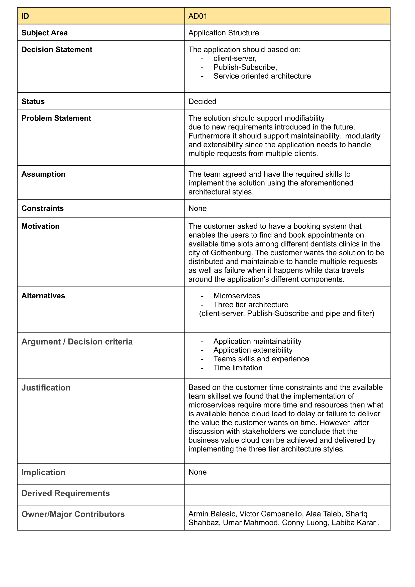
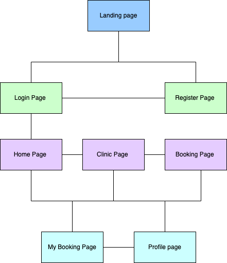
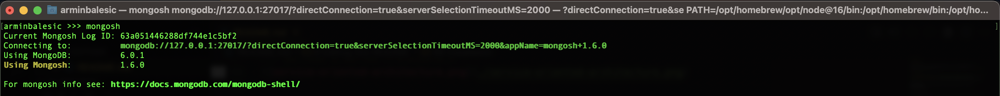
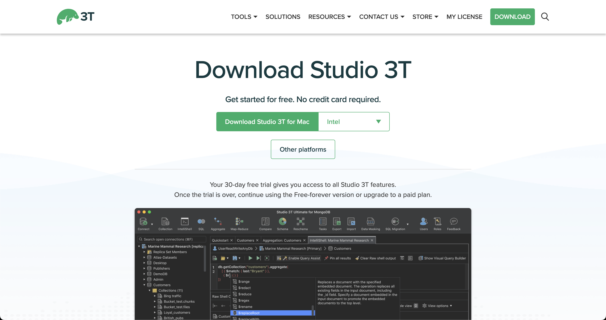
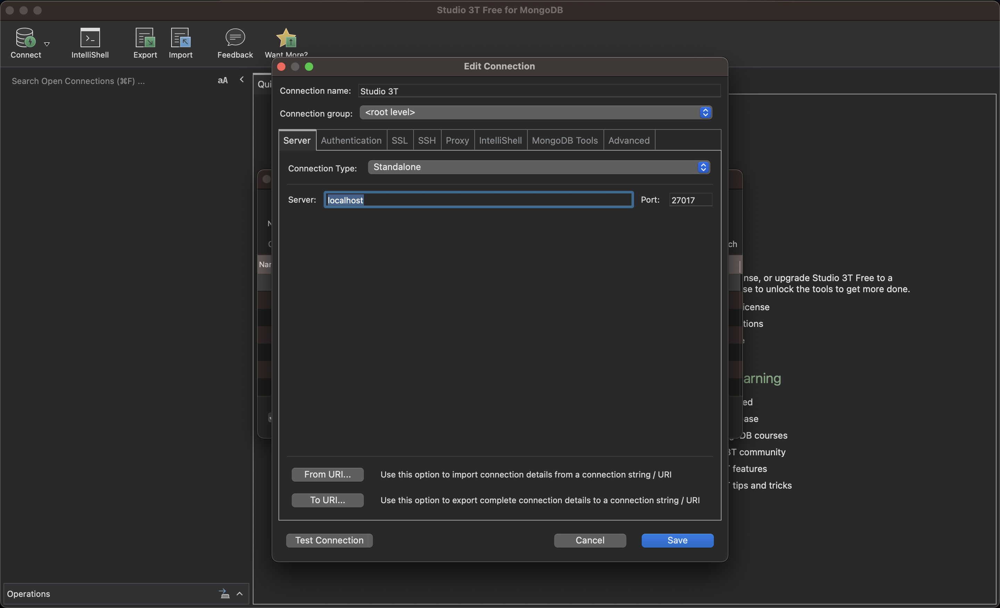
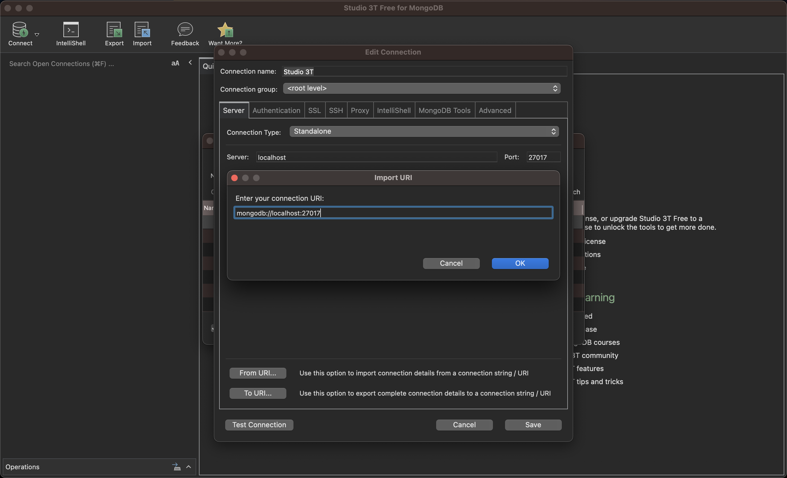
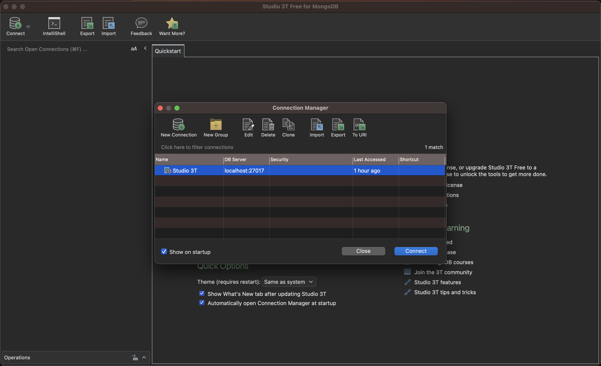
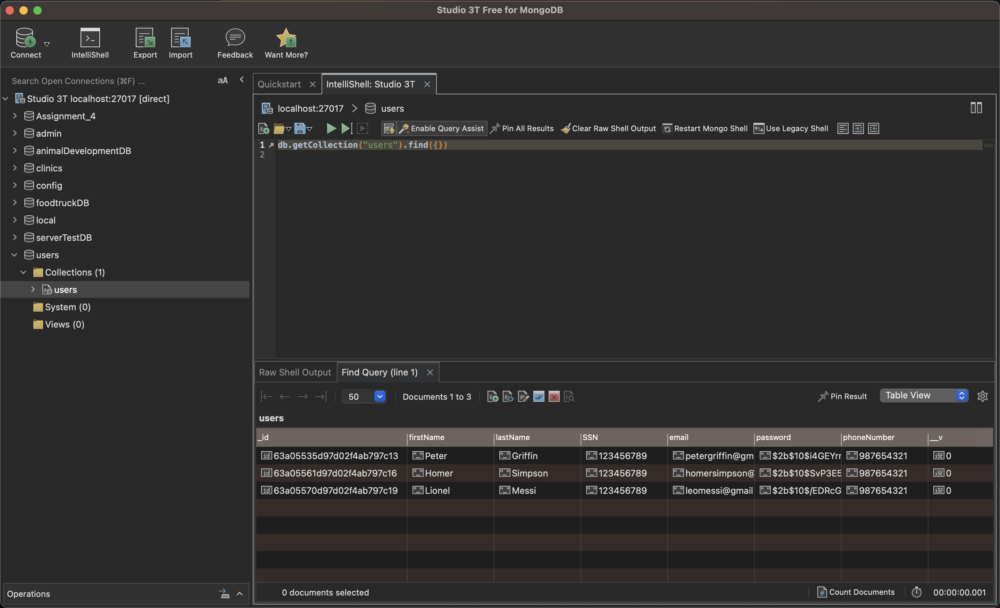

# T1-Project Documentation

# Editing this README

When you're ready to make this README your own, just edit this file and use the handy template below (or feel free to structure it however you want - this is just a starting point!). Thank you to [makeareadme.com](https://www.makeareadme.com/) for this template.

## Suggestions for a good README

Every project is different, so consider which of these sections apply to yours. The sections used in the template are suggestions for most open source projects. Also keep in mind that while a README can be too long and detailed, too long is better than too short. If you think your README is too long, consider utilizing another form of documentation rather than cutting out information.

## Name

Choose a self-explaining name for your project.

## Description

Let people know what your project can do specifically. Provide context and add a link to any reference visitors might be unfamiliar with. A list of Features or a Background subsection can also be added here. If there are alternatives to your project, this is a good place to list differentiating factors.

## Badges

On some READMEs, you may see small images that convey metadata, such as whether or not all the tests are passing for the project. You can use Shields to add some to your README. Many services also have instructions for adding a badge.

## Architecture

### Functional Decomposition Model (FDM)

*Figure X - The purpose of a functional decomposition model is to break down a system into its smaller components of functions. Our FDM can be read from left to right in a chronological order, from the point of when a user registers a new account to notification of a successful appointment booking.*

### Service-oriented Architecture (SOA)

*Figure X - placeholder*

### Entity Relationship (ER) Diagram

*Figure X - placeholder*

### Design decision tamplate

### Design decision tamplate

## Visuals

Depending on what you are making, it can be a good idea to include screenshots or even a video (you'll frequently see GIFs rather than actual videos). Tools like ttygif can help, but check out Asciinema for a more sophisticated method.

## Installation

Within a particular ecosystem, there may be a common way of installing things, such as using Yarn, NuGet, or Homebrew. However, consider the possibility that whoever is reading your README is a novice and would like more guidance. Listing specific steps helps remove ambiguity and gets people to using your project as quickly as possible. If it only runs in a specific context like a particular programming language version or operating system or has dependencies that have to be installed manually, also add a Requirements subsection.

### MongoDB and Studio 3T

#### 1. Check that you have mongo version ≥ 5, by running ’mongosh’ in your terminal. Install or update if you don't have mongo version 5 or above. Installtion instructions for various different OS's can be found here: https://www.mongodb.com/docs/manual/installation/.

#### 2. Download and install Studio 3T from https://studio3t.com/download/. Studio 3T is a GUI that enables easier interaction between the user and the database.

#### 3. Open Studio 3T and create a new connection if not already existing. This new connection is part of the setup where you declare through which URI your database and your backend service is communication through.

#### 4. Create the new connection by importing your URI ('mongodb://localhost:27017' for example in this project) with Connection Manager.

#### 5. Click ’save’ and then click ’connect’.

#### 6. Test your mongoDB connection and configuration by running one of your services through MQTT. Below follows an example from one of our sevices that creates a user in the DB when the user signs up on our web page.

## Usage

Use examples liberally, and show the expected output if you can. It's helpful to have inline the smallest example of usage that you can demonstrate, while providing links to more sophisticated examples if they are too long to reasonably include in the README.

## Support

Tell people where they can go to for help. It can be any combination of an issue tracker, a chat room, an email address, etc.

## Roadmap

If you have ideas for releases in the future, it is a good idea to list them in the README.

## Contributing

State if you are open to contributions and what your requirements are for accepting them.

For people who want to make changes to your project, it's helpful to have some documentation on how to get started. Perhaps there is a script that they should run or some environment variables that they need to set. Make these steps explicit. These instructions could also be useful to your future self.

You can also document commands to lint the code or run tests. These steps help to ensure high code quality and reduce the likelihood that the changes inadvertently break something. Having instructions for running tests is especially helpful if it requires external setup, such as starting a Selenium server for testing in a browser.

## The Team

- Armin Balesic
- Victor Campanello
- Labiba Eshaba
- Conny Luong
- Umar Mahmood
- Shariq Shahbaz
- Alaa Taleb

## License

MIT License

Copyright (c) 2023 DENTISTIMO

Permission is hereby granted, free of charge, to any person obtaining a copy of this software and associated documentation files (the "Software"), to deal in the Software without restriction, including without limitation the rights to use, copy, modify, merge, publish, distribute, sublicense, and/or sell copies of the Software, and to permit persons to whom the Software is furnished to do so, subject to the following conditions:

The above copyright notice and this permission notice shall be included in all copies or substantial portions of the Software.

THE SOFTWARE IS PROVIDED "AS IS", WITHOUT WARRANTY OF ANY KIND, EXPRESS OR IMPLIED, INCLUDING BUT NOT LIMITED TO THE WARRANTIES OF MERCHANTABILITY, FITNESS FOR A PARTICULAR PURPOSE AND NONINFRINGEMENT. IN NO EVENT SHALL THE AUTHORS OR COPYRIGHT HOLDERS BE LIABLE FOR ANY CLAIM, DAMAGES OR OTHER LIABILITY, WHETHER IN AN ACTION OF CONTRACT, TORT OR OTHERWISE, ARISING FROM, OUT OF OR IN CONNECTION WITH THE SOFTWARE OR THE USE OR OTHER DEALINGS IN THE SOFTWARE.

## Project status

If you have run out of energy or time for your project, put a note at the top of the README saying that development has slowed down or stopped completely. Someone may choose to fork your project or volunteer to step in as a maintainer or owner, allowing your project to keep going. You can also make an explicit request for maintainers.
