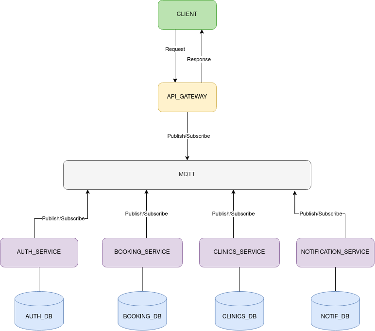

# T1-Project Documentation

# Purpose (Conny)
 - Team members Roles, and Tasks,  
 - Links to all relevant related team resources (Trello board, source-code repositories etc.) 

# Software Requirement Specification (SRS): (Labi and Victor)
 - focus on proper (SMART) phrasing of requirements 
 - requirements shall have unique ID’s 
 - team requirements logically 

# Software Architecture Document (SAD): (Shariq, Alaa & Umar)
# Deployment Diagram 

 - **include a clear description of the conceptual design  of  the  architecture; including architectural styles**

 - **include a section that explains how the conceptual design is mapped onto implementation/technologies.**

 

 - **Identify, state and justify any architecture design decisions or tactics used:**

   - To improve fault tolerance for the distributed system as a whole, we implemented a set standard for error communication between the components, the standard is known as MQTTErrorException in code and is used to effectively and reliably transfer errors from the service layer to the client. 

   - To improve the security of our application, we limit the access of unauthenticated users, the authentication is implemented using a token based approach by making use of JSON Web Tokens.

   - Although MQTT is the main protocol for inter-service communication, to allow frontend clients to interact with applications, we use the traditional Client/Server approach over HTTP. This means that the clients never interact with the broker, providing an extra layer of security from attacks such as DOS, DDOS and Fingerprinting among others. Although this adds further complexity for implementing reactive components, the benefits outweigh the disadvantages, and alternatives such as (SSEs and websockets are available for reactive applications).

   - We use an API gateway which is the entry point into the backend system, this component is responsible for properly forwarding client requests and returning service responses back to the client. This is also where a circuit breaker is implemented so that the application can react to failures in an efficient manner, improving performance and reliability.

# Program Management Report (PMR): (Armin)
 - describe the project management practices used 
 - report on important project management decisions regarding schedule and scope. (weekly updates) 

# Architecture (This will fall under SAD)

## Architectural Significant Requirements
Concurrency – The system should not allow concurrent bookings. That means, if
two or more users make bookings at the same clinic, to the same dentist at the same
time, the system will be able to handle it in a proper way. Meaning one user should
receive a confirmation and the other a rejection.

Resilience to failure – Solid error handling for all entry points into the system is an
important consideration for the system as it is trusted to handle data from the general
public by the government.

Openness – The system should be open to new features since we know that new
requirements will be added in the project.

Security – The system shouldn’t allow users to access unauthorized accounts or
change other users' booking.

Transparency – The system should seem to be like a single, coherent entity for one
user rather than individual components.

## Functional Decomposition Model (FDM)

*Figure X - The purpose of a functional decomposition model is to break down a system into its smaller components of functions. Our FDM can be read from left to right in a chronological order, from the point of when a user registers a new account to notification of a successful appointment booking.*

## Service-oriented Architecture (SOA)

*Figure X - placeholder*

## Entity Relationship (ER) Diagram

*Figure X - placeholder*

## Design decision tamplate

## Sitemap

## Visuals (Victor if time)

Depending on what you are making, it can be a good idea to include screenshots or even a video (you'll frequently see GIFs rather than actual videos). Tools like ttygif can help, but check out Asciinema for a more sophisticated method.

# Installation instructions (instructions for adding node.js, yarn and mongo)

## MongoDB and Studio 3T

### 1. Check that you have mongo version ≥ 5, by running ’mongosh’ in your terminal. Install or update if you don't have mongo version 5 or above. Installation instructions for various different OS's can be found here: https://www.mongodb.com/docs/manual/installation/.

### 2. Download and install Studio 3T from https://studio3t.com/download/. Studio 3T is a GUI that enables easier interaction between the user and the database.

### 3. Open Studio 3T and create a new connection if not already existing. This new connection is part of the setup where you declare through which URI your database and your backend service is communication through.

### 4. Create the new connection by importing your URI ('mongodb://localhost:27017' for example in this project) with Connection Manager.

### 5. Click ’save’ and then click ’connect’.

### 6. Test your mongoDB connection and configuration by running one of your services through MQTT. Below follows an example from one of our sevices that creates a user in the DB when the user signs up on our web page.

# The Team

- Armin Balesic gusbalar@student.gu.se
- Victor Campanello guscampvi@student.gu.se
- Labiba Karar Eshaba guseshka@student.gu.se
- Conny Luong gusluoco@student.gu.se
- Umar Mahmood gusmahum@student.gu.se
- Shariq Shahbaz gusshahbsh@student.gu.se
- Alaa Taleb gustalebal@student.gu.se

# License

MIT License

Copyright (c) 2023 DENTISTIMO

Permission is hereby granted, free of charge, to any person obtaining a copy of this software and associated documentation files (the "Software"), to deal in the Software without restriction, including without limitation the rights to use, copy, modify, merge, publish, distribute, sublicense, and/or sell copies of the Software, and to permit persons to whom the Software is furnished to do so, subject to the following conditions:

The above copyright notice and this permission notice shall be included in all copies or substantial portions of the Software.

THE SOFTWARE IS PROVIDED "AS IS", WITHOUT WARRANTY OF ANY KIND, EXPRESS OR IMPLIED, INCLUDING BUT NOT LIMITED TO THE WARRANTIES OF MERCHANTABILITY, FITNESS FOR A PARTICULAR PURPOSE AND NONINFRINGEMENT. IN NO EVENT SHALL THE AUTHORS OR COPYRIGHT HOLDERS BE LIABLE FOR ANY CLAIM, DAMAGES OR OTHER LIABILITY, WHETHER IN AN ACTION OF CONTRACT, TORT OR OTHERWISE, ARISING FROM, OUT OF OR IN CONNECTION WITH THE SOFTWARE OR THE USE OR OTHER DEALINGS IN THE SOFTWARE.
